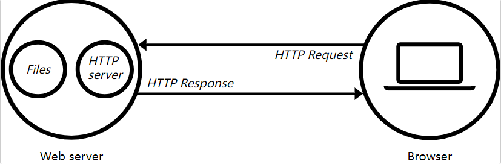
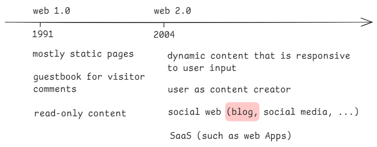

## 名词释义
- webpage：能够显示在web浏览器上的文档
- website：许多网页组合成网站
- web server：在web上托管网站的服务器
- search engine：能够帮助使用者查找网页的服务
- 连接上述诸位的就是web：内联网、外联网和互联网的范围见下图
- HTTP：规范两台计算机间传输超文本的文本化无状态协议
- IP address：任何连上互联网的电脑都能通过公共IP地址来访问
- domain name：为互联网上任何可用的web服务器提供人类能理解的地址

## Web 发展史

博客属于web 2.0的产物，承载着使用者的表达和记录。
