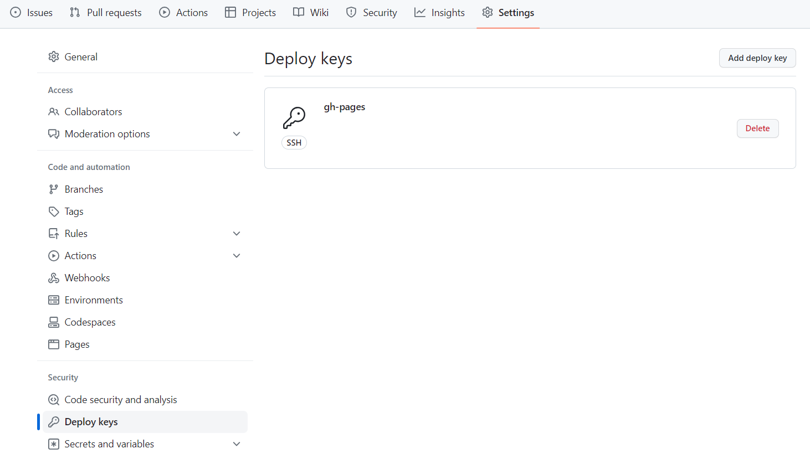
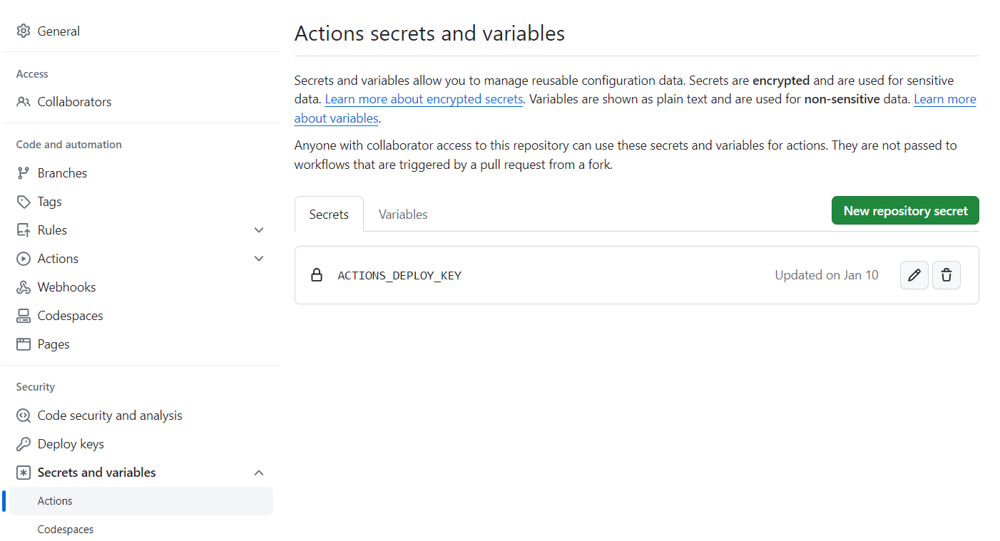

## Prerequisite

将本地仓库推送到GitHub：[[Connect git to GitHub]]

## Reference

- [Build Hugo With GitHub Action](https://gohugo.io/hosting-and-deployment/hosting-on-github/)
- [Create and host a blog with Hugo and GitHub Pages in less than 30 minutes](https://www.mytechramblings.com/posts/create-a-website-with-hugo-and-gh/)
- [Creating a personal access token](https://docs.github.com/en/authentication/keeping-your-account-and-data-secure/creating-a-personal-access-token#creating-a-token)
- [基于 Github Action 自动构建 Hugo 博客 - (lixueduan.com)](https://www.lixueduan.com/posts/blog/01-github-action-deploy-hugo/)：讲清楚了GitHub Action中的.yml配置文件代码具体是怎样连接GitHub上的两个仓库的
- [折腾Hugo | GitHub Pages | Github Actions自动构建发布免费个人网站 - 知乎 (zhihu.com)](https://zhuanlan.zhihu.com/p/109057290) ：步骤清晰，看完就能知道怎么给GitHub上的两个仓库配置公钥私钥
- [使用 Hugo + GitHub Actions 升级博客 // 风行's Blog (lijingcheng.github.io)](https://lijingcheng.github.io/posts/hugo/)
- [ssh-keygen 生成密钥](https://gnu-linux.readthedocs.io/zh/latest/Chapter01/00_ssh-keygen.html)
## Log

>The GitHub Action is going to grab the content from the `XXX_source` repository, build it using Hugo and push the output into the `XXX` repository.

- 在本地电脑中创建一个新的SSH密钥对：
  - `ssh-keygen -t rsa -b 4096 -C "yourmail@mail.com" -f ~/.ssh/gh-pages -N ""`
- 给Github上绑定GitHub Pages的公开仓库添加公钥：
  - 
- 给Github存放网站源码的私人仓库添加私钥：
  - 
- 在项目文件夹中新建一个文件 `.github/workflows/gh-pages.yml`：
  - 添加下面脚本内容：
```shell {lineNos=true, tabWidth=2}
name: Deploy Hugo Site to Github Pages on Main Branch

on:
  push:
    branches:
      - main

jobs:
  build-deploy:
    runs-on: ubuntu-latest
    steps:
      - uses: actions/checkout@v1  # v2 does not have submodules option now
       # with:
       #   submodules: true

      - name: Setup Hugo
        uses: peaceiris/actions-hugo@v2
        with:
          hugo-version: 'latest'
          extended: true

      - name: Build
        run: hugo --minify

      - name: Deploy
        uses: peaceiris/actions-gh-pages@v3
        with:
          deploy_key: ${{ secrets.ACTIONS_DEPLOY_KEY }} # 这里的 ACTIONS_DEPLOY_KEY 则是上面设置 Private Key的变量名
          external_repository: Morimit/Morimit.github.io # Pages绑定的远程仓库 
          publish_dir: "./public" 
          keep_files: false # remove existing files
          publish_branch: main  # deploying branch
          commit_message: ${{ github.event.head_commit.message }}

```
- 上面的步骤完成后，每次从本地git push源文件到GitHub都会触发GitHub action把publish文件夹更新到GitHub pages。

## 搭建完成后的workflow

[workflow]( "workflow")
