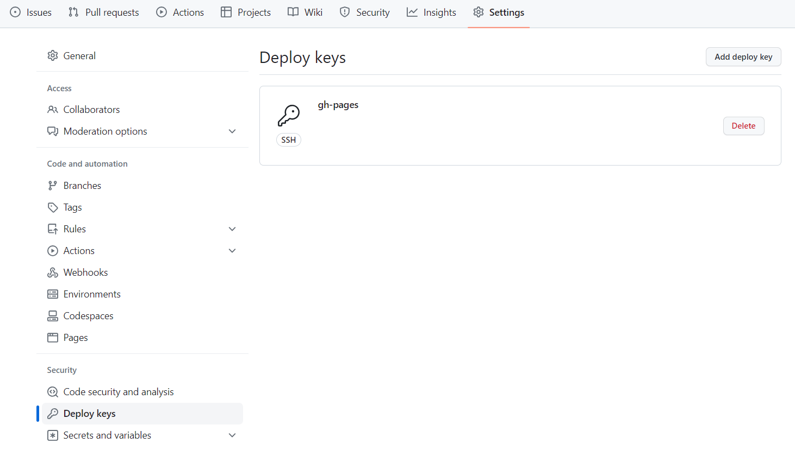
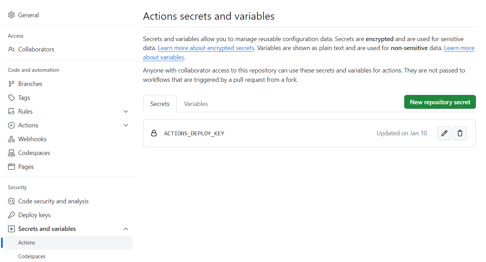
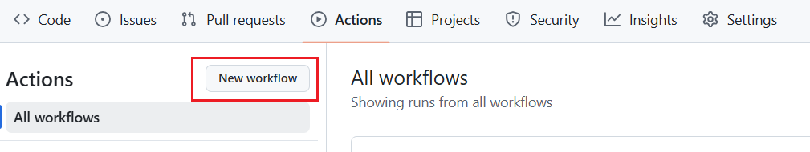
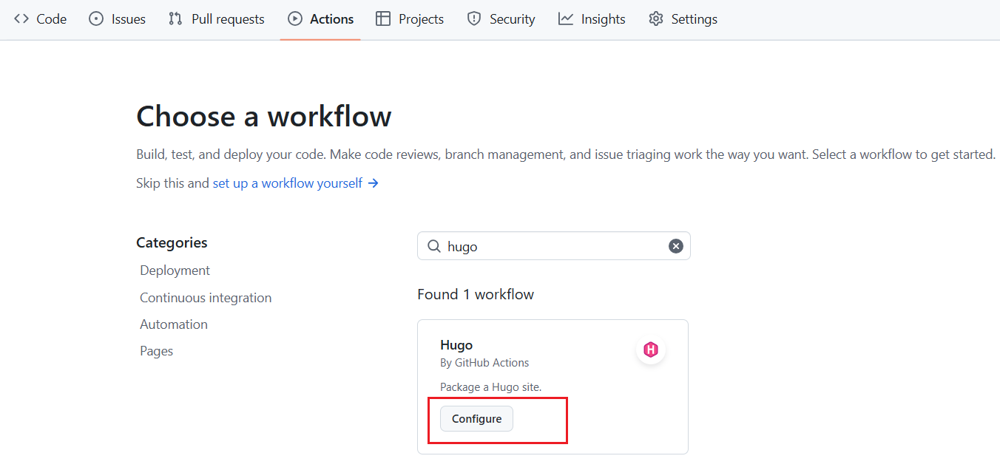
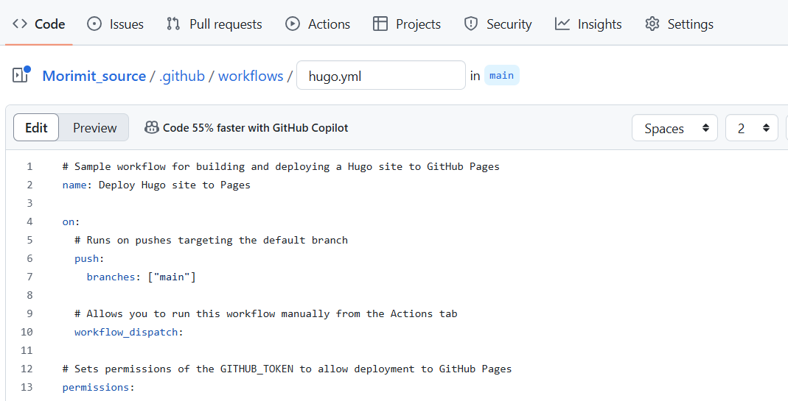
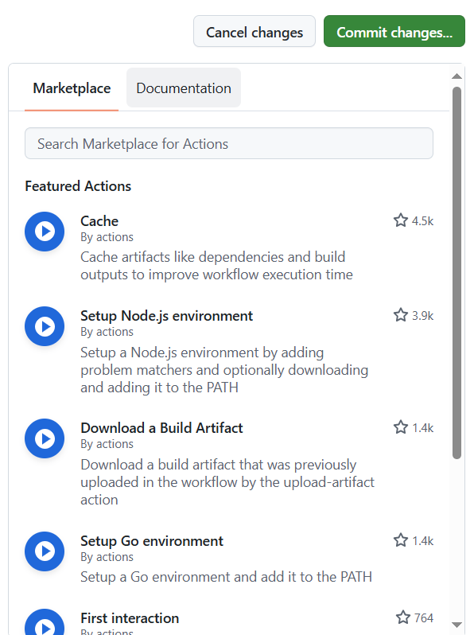

## Reference
- [GitHub Actions 入门教程](https://www.ruanyifeng.com/blog/2019/09/getting-started-with-github-actions.html)
- [Build Hugo With GitHub Action](https://gohugo.io/hosting-and-deployment/hosting-on-github/)
- [Create and host a blog with Hugo and GitHub Pages in less than 30 minutes](https://www.mytechramblings.com/posts/create-a-website-with-hugo-and-gh/)
- [Creating a personal access token](https://docs.github.com/en/authentication/keeping-your-account-and-data-secure/creating-a-personal-access-token#creating-a-token)
- [基于 Github Action 自动构建 Hugo 博客 - (lixueduan.com)](https://www.lixueduan.com/posts/blog/01-github-action-deploy-hugo/)：讲清楚了GitHub Action中的.yml配置文件代码具体是怎样连接GitHub上的两个仓库的
- [折腾Hugo | GitHub Pages | Github Actions自动构建发布免费个人网站 - 知乎 (zhihu.com)](https://zhuanlan.zhihu.com/p/109057290) ：看完就能知道怎么给GitHub上的两个仓库配置公钥私钥
- [使用 Hugo + GitHub Actions 升级博客 // 风行's Blog (lijingcheng.github.io)](https://lijingcheng.github.io/posts/hugo/)
- [ssh-keygen 生成密钥](https://gnu-linux.readthedocs.io/zh/latest/Chapter01/00_ssh-keygen.html)

## Prerequisite

建立好本地仓库和GitHub的连接：[Connect Git to GitHub]()


## Steps
Github Actions是GitHub提供的，使用脚本的大致作用如下：
>The GitHub Action is going to grab the content from the `XXX_source` repository, build it using Hugo and push the output into the `XXX` repository.

### 创建一个新的SSH密钥对：
```bash
ssh-keygen -t rsa -b 4096 -C "yourmail@mail.com" -f ~/.ssh/gh-pages -N ""
```
### 给绑定GitHub Pages的公开仓库添加公钥：

### 给源码仓库添加私钥：
注意：此 private key 的名称之后要填入 Action 脚本的特定位置。

### 给源码仓库添加脚本
在源码仓库中找到Actions栏，新建workflow：


可以直接找到workflow的模板：




可以在右侧查看actions市场和GitHub Actions的使用文档：


### 修改脚本内容
一些专用术语：

- workflow （工作流程）：持续集成一次运行的过程，就是一个 workflow。
- job （任务）：一个 workflow 由一个或多个 jobs 构成，含义是一次持续集成的运行，可以完成多个任务。
- step（步骤）：每个 job 由多个 step 构成，一步步完成。
- action （动作）：每个 step 可以依次执行一个或多个命令（action）。

脚本内容修改如下：
```shell {lineNos=true, tabWidth=2}
name: Deploy Hugo Site to Github Pages on Main Branch

# 触发条件是git push
on:
  push:
    branches:
      - main
      - test

jobs:
  build-deploy:
    runs-on: ubuntu-latest
    steps:
      - uses: actions/checkout@v1  # v2 does not have submodules option now
       # with:
       #   submodules: true

      - name: Setup Hugo
        uses: peaceiris/actions-hugo@v2
        with:
          # The Hugo version to download (if necessary) and use. Example: 0.58.2
          hugo-version: '0.108.0'  # default is 'latest', better use your local development version
          extended: true

      - name: Build
        run: hugo --minify

      - name: Deploy
        uses: peaceiris/actions-gh-pages@v3
        with:
          deploy_key: ${{ secrets.ACTIONS_DEPLOY_KEY }} # 这里的 ACTIONS_DEPLOY_KEY 则是上面设置 Private Key的变量名
          external_repository: Morimit/Morimit.github.io # Pages绑定的远程仓库 
          publish_dir: "./public" 
          keep_files: false # remove existing files
          publish_branch: main  # deploying branch
          commit_message: ${{ github.event.head_commit.message }}

```
- 注意：`publish_branch`要和该仓库绑定GitHub Pages的发布branch相一致
- 上面的步骤完成后，每次从本地git push源文件到GitHub都会触发GitHub Actions脚本把`./public`文件夹更新到GitHub pages。


## 搭建完成后的workflow

[workflow]()


