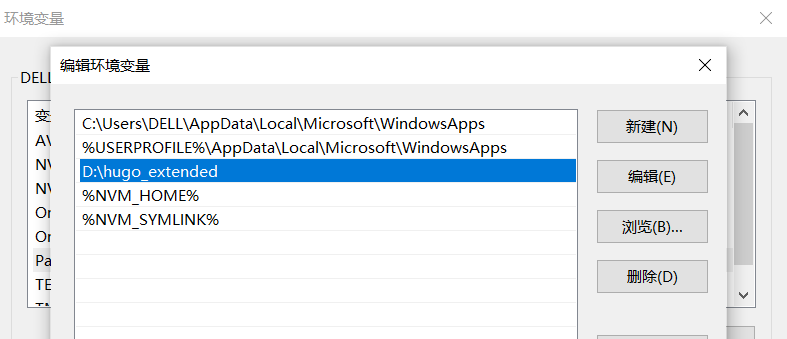
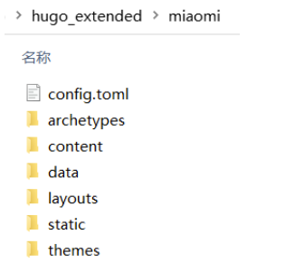
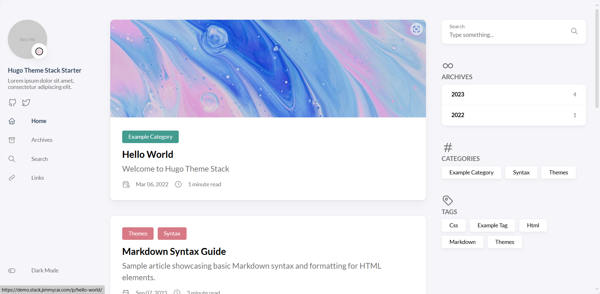
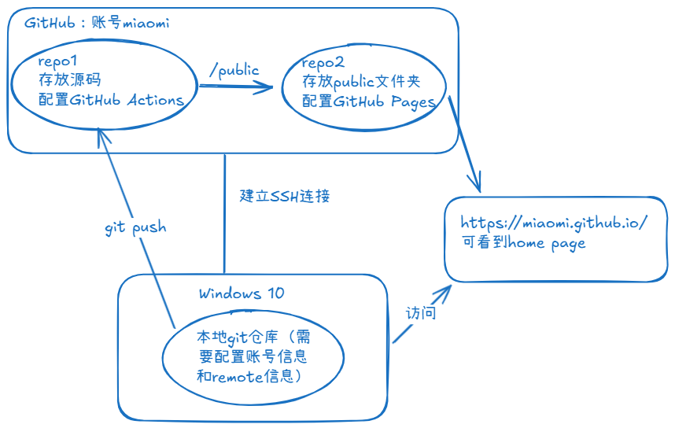
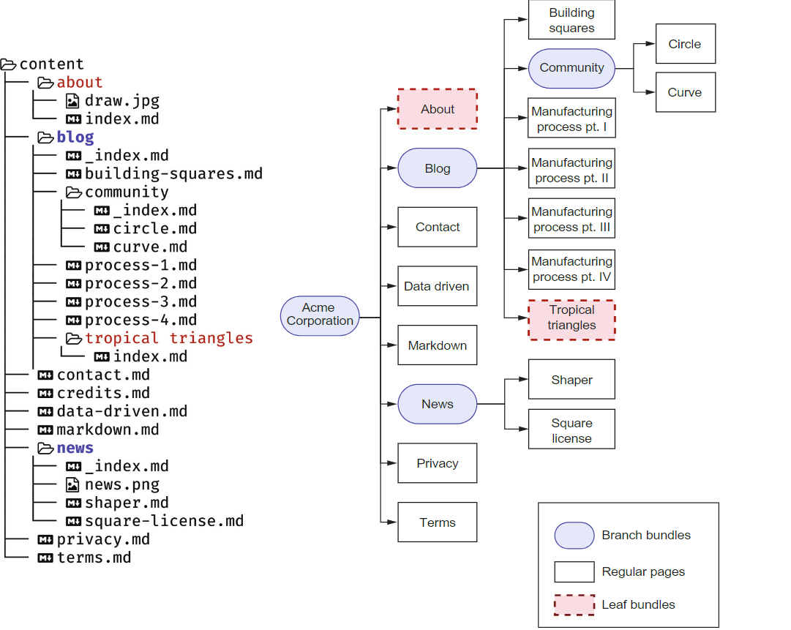
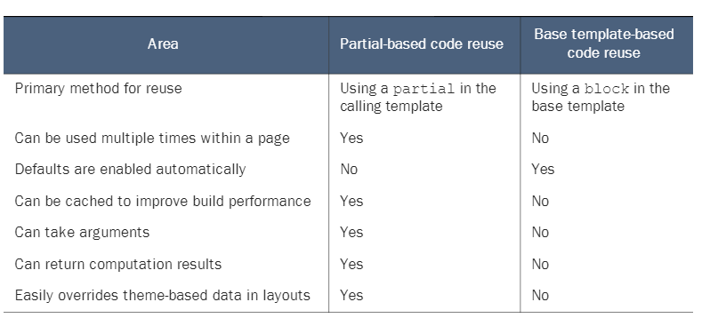

## 博客规划
### 定位
明确自己的核心需求就两个：
- 技术笔记本
- 一些其他posts
### 页面规划
#### 主页
  - 参考一些博客、小说、视频、新闻网站，展示页适合使用摊开的卡片形式，可以一目了然地看到所有posts的信息
  - **posts在本博客中是使用tags来管理的、互相没有上下级关联的博文**


#### 笔记
  - 存放所有notes——以文档的形式罗列，每个note都具有总体章节目录和本节内容目录
  - **notes在本博客中是使用notes分类来管理、互相之间有层级关系的博文，且不会出现在主页展示**
  - 由于页面的布局很满了，所以目录的滚动条都要隐藏，鼠标放在目录上能滚动即可
  - 还有有种方式是折叠目录，但我更喜欢摊开的感觉

#### 项目
  存放一些小项目。

#### 存档
  存放所有notes和posts中的博文，考虑到博文的数量，按年份来分隔比较合理，并且不需要分页，因为分页有种切割了时间流的感觉。

#### 关于
关于网站的信息和一些碎碎念。

#### RSS订阅
可以使用inoreader等RSS阅读器来订阅博文。

## 搭建记录
### 一句话总结
首先Hugo能够生成可以发布的静态网站文件，其次使用Git进行版本控制，每次修改后可以把源码传到GitHub，最后GitHub对Hugo建站有完整的支持组件（GitHub Actions、GitHub Pages），所以才能顺利完成一系列自动部署。

### 初始化git仓库
git是一个分布式版本控制系统，可以用来追踪博客的成长变动。

把存放博客的文件夹变成一个git仓库：
```bash 
git init
```

### 本地安装Hugo
- 安装环境：Windows 10
- 安装步骤参考[官方文档](https://gohugo.io/installation/windows/)，或者[中文文档](https://www.gohugo.org/)

在这里我安装预编译的二进制版本，此版本是已经编译好的应用程序，不依赖Go环境，优点是可以直接运行，缺点是不能直接修改源码。

下载后需要添加环境变量，这样才能够在不同的文件夹中使用Hugo程序。在系统变量和用户变量的Path中都添加：


然后就可以进入想要存放博客的文件夹，使用命令创建新站：
```bash
  hugo new site 项目名
```
此时在根目录文件夹下可以发现Hugo已经创建了一些文件夹：

### 选择并了解Hugo主题
- 本博客主题选用参考了[Hugo-stack-theme 主题魔改版](https://mantyke.icu/posts/2022/stack-theme-mod/)
- stack主题的特点之一是使用原生JS和CSS代码，没有使用框架。

直接下载Stack主题到`./themes`文件夹中，并按照主题readme文档的提示进行一些配置。

再回到根目录下使用命令来预览：
```bash
hugo server
```
这条命令会在运行内存中构建网站，并让网页跑在一个最小化的HTTP server中，这意味着可以一边修改网站一边看到修改效果。



关于web server更详细的解释：
> While the server is running, it watches your project directory for changes to assets, configuration, content, data, layouts, translations, and static files. When it detects a change, the server rebuilds your site and refreshes your browser using [LiveReload](https://github.com/livereload/livereload-js).
>
>
>about [LiveReload](https://github.com/livereload/livereload-js):
> While the server is running, Hugo injects JavaScript into the generated HTML pages. The LiveReload script creates a connection from the browser to the server via web sockets. You do not need to install any software or browser plugins, nor is any configuration required.

注意Hugo都是从根目录开始渲染的，所以如果根目录的layouts和contents有内容，就会忽略themes文件夹中的同名文件夹。

以及如果出现不同后缀名的config文件，不同格式的优先级是toml>yaml>json。

（优先级细节可查看官方文档的lookup order）
### 创建网站
真正创建网站的是下面一行命令：
```bash
hugo
```
此命令会在网站根目录下创建public文件夹，这里存放的就是整个完整的网站，如果把public文件夹放在IIS之类的web服务器上，稍加修改config.yaml文件中的baseurl后就能直接打开。
### 搭建workflow
- 静态博客的工作流理想状态是本地修改内容后推送到远端，推送命令会触发远端更新网站。
- 拆解这个过程：
  - 需要一个版本控制系统来管理每次修改的内容
  - 远端需要有个存放源码的仓库
  - 需要将网站源码推送到远端
  - 远端需要一个静态网站托管服务/云主机
  - 远端源码仓库有变动，就要重新用`hugo`命令生成一次public文件夹，并把变动后的public文件夹推送给托管网站/云主机
  - 托管服务通过public文件夹展示网页
- 对应的步骤是：
  - 使用git管理代码变化
  - 将本地git仓库与GitHub仓库连接：[用 SSH 方式配置多个账号连接 GitHub]( "connect git to GitHub")
  - 新建两个GitHub仓库（GitHub有提供静态网站托管服务——GitHub Pages）
  - 存放源码的仓库中用GitHub Actions建立CI/CD：[Hugo workflow]()（检测到git push操作后将public文件夹推送给GitHub Pages绑定的仓库）
  - [使用GitHub Pages部署项目]()



完成上面的步骤后，就能够在公网上看到网站了。

### 进阶：修改主题
- 直接上手修改会很捉急，因为Hugo并不是直接用html、css、js代码粘合的，还需要了解一些必要的Go模板语言知识
- 直接看官方文档又多又杂，即使看完getting started也容易依然一头雾水
- 所以建议可以从自己下载好的主题代码出发，了解：
  - 文件夹之间的对应关系
  - 每个代码文件在页面中的作用
  - 每个伪API的作用
- 一些小tips：
  - `.`代表传入每个区域的上下文（context）
  - layouts文件夹中最重要的是index.html，它是整个网站的home页面布局。
  - baseof.html是layouts/_default中每个文件布局的模板
  - Hugo有leaf bundle和branch bundle的概念：
  - 每个branch bundle都是section，section页面默认对应list.html，根目录的section页面（比如上图的about）对应_default文件夹中的同名html文件（about.html）
  - 每个leaf bundle都是single页面，所有single页面对应single.html
  - Hugo没有subsection的概念，当section和subsection需要有不同布局的时候，如果不能修改生成器代码，就只能曲折地实现——把根目录下的section页面当作subsection
  - 本博客中posts和notes中的单页面都对应single.html，但它们分属不同的section，所以可以拿sectionName来做区分
  - 除了使用默认的tags和categories来分类外，可以自定义分类，本博客就自定义了notes分类。
  - layouts中相似的布局可以解耦出来，放到partials文件夹下。比如home页面和about页面都需要left banner，那么left banner就可以拆分出来作为一个组件。使用partials和定义blocks的区别：
  - Hugo支持在markdown文件中插入html代码，可以直接插入标签，也可以用Go模板语言调用layouts中定义的shortcodes。
- 一些可能用到的参考：
  - [Page methods：每个single页面的 `.` 都是page object](https://gohugo.io/methods/page/)
  - [Go template: functions, operators, and statements](https://gohugo.io/functions/go-template/)
  - [collections.Where：常用来排除集合中某些项的函数](https://gohugo.io/functions/collections/where/#operators)
  - [Collections functions：每个collection可以使用的函数](https://gohugo.io/functions/collections/)
  - [Compare functions：非常好用的比较函数](https://gohugo.io/functions/compare/)
  - [Glossary of terms：不懂得术语可以随时在此查询](https://gohugo.io/getting-started/glossary/)


### 添加内容
此时可以愉快地为博客添加内容了。因为每次添加frontmatter非常繁杂，所以建议基于archetypes文件夹中的模板来创建新markdown文档：

- archetypes文件夹中的每个文件对应一种内容类型，可以自定义：
  - `archetypes/default.md`：用于没有指定内容类型时的默认模板。
  - `archetypes/post.md`：专门用于创建博客文章的模板。
  - `archetypes/note.md`：专门用于创建笔记页面的模板。
- 然后在根目录下，可以使用命令创建md文档：

```bash
hugo new post/my-first-post.md
```

## 最后形成的使用动线
[Blog Workflow]()

## 参考
- [Hugo Docs](https://gohugo.io/getting-started/quick-start/): 内容多而全，适合查询
- [Hugo In Action](https://www.manning.com/books/hugo-in-action)：系统且挑重点，适合快速过一遍
- [Hugo tutorial by CloudCannon](https://cloudcannon.com/community/learn/hugo-101/): Got a roughly picture of the file hierarchy of Hugo.          
- [Build Websites with Hugo](https://pragprog.com/titles/bhhugo/): A complete guide.
- [不是从零开始的 Hugo 建站笔记](https://fourxiajiao.github.io/2022/hugo-blog/)
- [Create and host a blog with Hugo and GitHub Pages in less than 30 minutes](https://www.mytechramblings.com/posts/create-a-website-with-hugo-and-gh/)
- [Hugo | 在文章中插入轮播图片](https://mantyke.icu/posts/2021/cf2cf0fb/)
