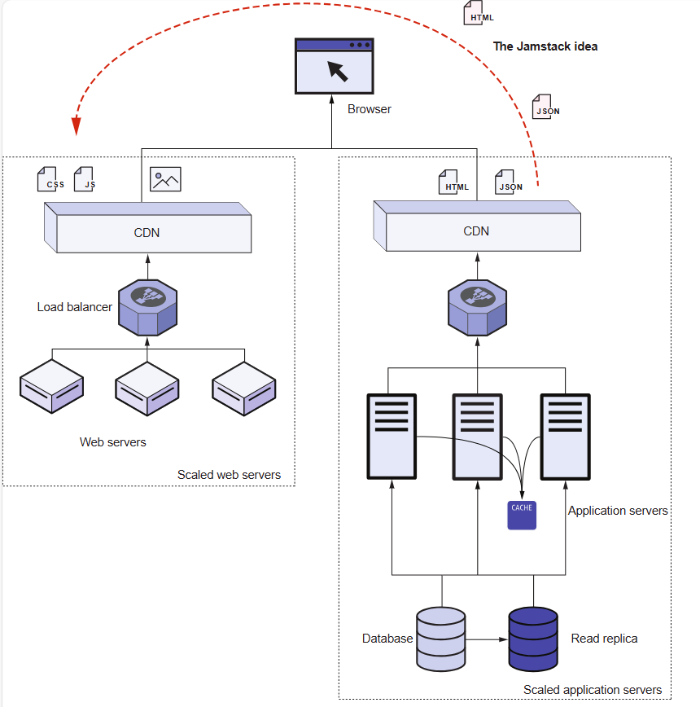
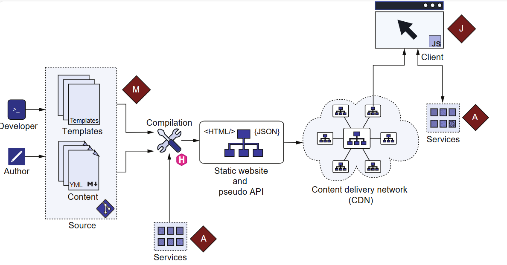
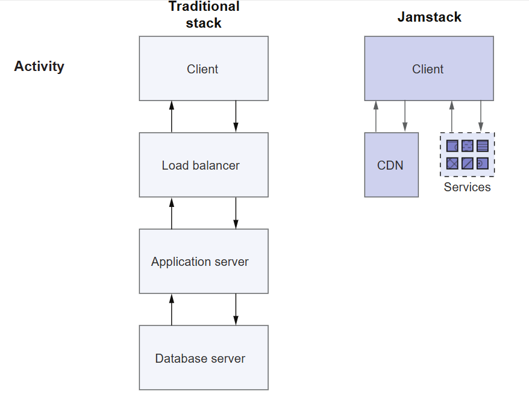

本章图片来源：hugo in action

## 博客类型
从博客使用者的角度，按照是否有后台能够在线编辑博文，博客可分为：
- 静态博客
- 动态博客

从博客开发的角度看，动态博客多了应用服务器和数据库的部分。


一些流行的Web技术栈包括LAMP(Linux、Apache、MySQL、PHP)、Microsoft.NET(IIS、ASP.NET、MS SQL Server)、MEAN(MongoDB、Express、Angular、Node.js)和MERN(MongoDB、Express、Reaction、Node.js)。

像Apache或IIS这样的Web服务器主要在传统的Web技术栈中托管静态资产，如图像、JavaScript和CSS,这些静态文件不会在多个用户之间更改。 第二组资产是动态内容，可以有所不同，它基于提供的请求参数，包括URL，请求标头，cookie或相关的HTTP POST数据，安装了PHP、ASP.NET或Express等软件的应用程序服务器会获取这些参数并创建响应


## 动态博客
- 可以登录并进入网页后台在线编写文章、管理评论，发布和修改文章比静态博客方便，可以实时更新
- 搭建时需要租用/购买服务器，要考虑服务器的安全问题

### halo
开源建站工具，不用写代码，直接生成网页，但要有一台可访问公网的服务器（云主机或实体服务器），并需要进行以下服务器配置：
  - 服务器的连接与管理：SSH工具（如SecureCRT）、SFTP工具（向服务器上传文件）
  - 服务器应用安装与环境部署
  - 准备网站源码或安装包（jar包）进行部署。
  - 防火墙开放8090端口，这是网站打开访问的端口 (`xxx.xxx.xxx.xxx:8090`）。
  - 可以下载一些主题包，在控制台页面安装。
  - 在服务器上安装nginx。一般来说我们不会用jar包启动的8090端口的服务去直面用户，而是会在中间加一层代理服务器做转发服务（负载均衡、扛并发）。常用的代理服务器就是nginx（默认在80端口启动web服务）。
  - 配置nginx，让它代理到jar包启动的地址（xxx.xxx.xxx.xxx:8090），即可不用写8090端口访问。

  
### Wordpress
可用docker搭建；基于PHP语言；搭建步骤大致如下：
- 购买主机和域名
- 安装docker
- 搭建博客。下载docker-compose.yml文件，再用一行命令启动博客（yml文件里包含了从docker官方仓库拉取服务镜像，包括mysql和需要的web服务）。
- 登录（localhost:8000），选择语言、登录账户设置，即可以看到博客后台。
- 最后可更换主题和插件

## 静态博客
- 使用博客生成器生成网站（一个包含一堆HTML文件的文件夹），每次发布/修改内容都需要重新生成此文件夹
- 网站放在托管平台，利用GitHub Pages、Netlify、vercel等可以做免费托管，无需购买服务器
- 利用GitHub Actions实现简单的CI/CD
- 缺点是扩展时受限于生成器提供的API

了解博客生成器之前，最好先了解Jamstack。J、A、M分别代表JavaScript、APIs、Markup，也即此技术栈的核心：

首次发出获取HTML页面的请求运行时Jamstack与传统Web技术栈的对比：


使用Jamstack，编译步骤已经执行了数据库处理和基于应用程序逻辑的拼接。 这种HTML生成并不是针对每个请求都发生的。 因此，该请求不需要通过互联网访问原始服务器。 而是在地理位置上靠近客户端的CDN提供内容。


可以看到Jamstack将大部分逻辑从应用程序中移出到web服务器，与应用程序服务器相比，web服务器的安全问题和维护需求更少，如果使用托管服务，则能最大程度减少维护工作。

### Hugo
基于Go语言；生成站点的速度非常快。

### Hexo
基于Node.js，很多主题稍作修改后Hugo也可以用。

