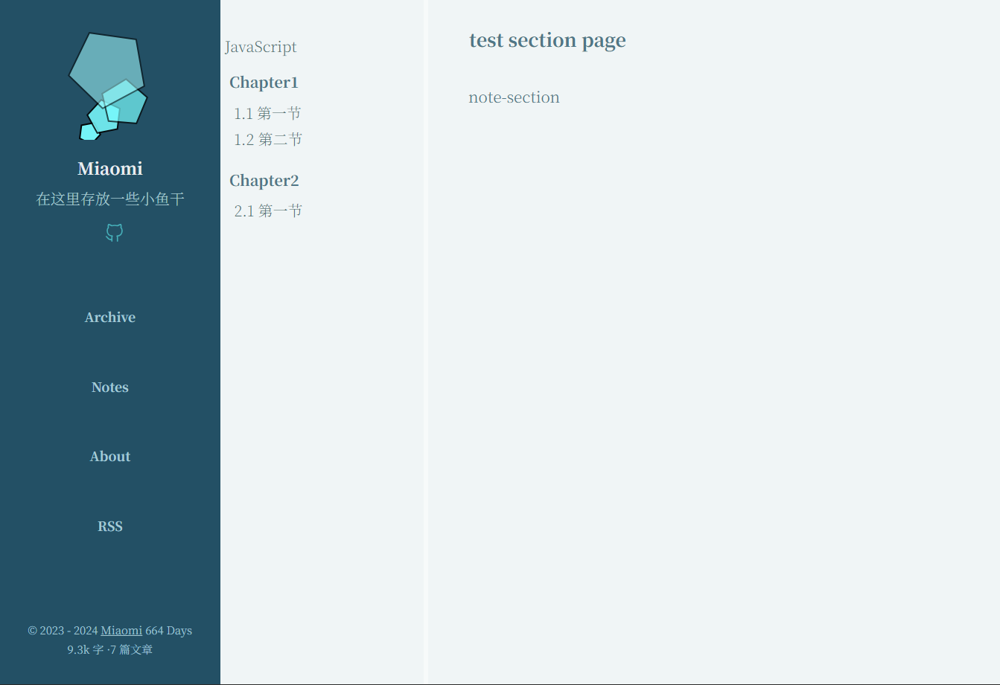

## 添加文章

### 添加post文章
不需要指定模板，Hugo会使用 `archetypes/default.md`模板来建立文档：
```bash
hugo new post/my-first-post.md
```
### 添加notes文章

指定模板，使用命令`hugo new [文件路径]/[文件名].md -k  [archetype name]`

比如添加JavaScript这个笔记，需要按照如下格式：

1. 在`./content`目录下新建`javascript`文件夹和`_index.md`

```bash
hugo new javascript/_index.md -k note-section.md
```

2. 在`./content/javascript`目录下添加chapter：
```bash
hugo new javascript/chapter1/_index.md -k note-section.md
```

3. 在`./content/javascript/chapter1`目录下添加每一节：
```bash
hugo new javascript/chapter1/1.1/index.md -k note.md
```
最后可以用`hugo server` 命令查看修改效果，如果再加上`--buildDrafts`可以查看草稿文件 ：



### 将本地变化推送到远程仓库

```bash
git pull
git add . #添加修改后的所有文件到stage area
git commit -m "添加评论" #把stage area的文件提交到分支
git push origin main #推送到源码仓库
# 最后可在`https://xxxxx.github.io` 处查看发布好的网站。
```


## 改动博客样式

### 切换到测试分支开发
```bash
git branch #查看所有分支
git checkout -b test #新建并切换到test分支
```

### 完成后合并到main分支
```bash
git switch main #切换到main分支
git merge --no-ff -m "merge with no-ff" test #在非fast forward模式下合并分支
git log --graph --pretty=online --abbrev-commit #可以查看合并结果
git push origin main 
#手动删除远程仓库内的test分支
git branch -d test #删除本地test分支
git fetch --prune #删除远程仓库中删除的分支的引用
```
