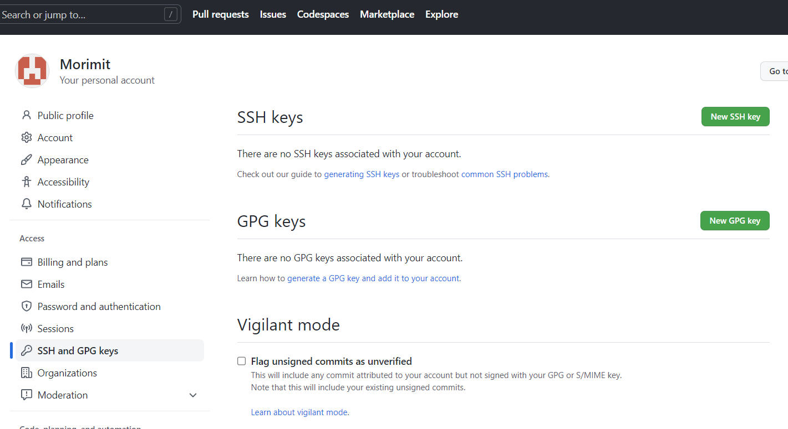

## 在git bash终端创建两个SSH key:
```shell
ssh-keygen -t rsa -f ~/.ssh/id_rsa_m -C "firstmail@gmail.com" #绑定hugo网站源代码存放的GitHub所用的邮箱
ssh-keygen -t rsa -f ~/.ssh/id_rsa -C "secondmail@gmail.com" #绑定另一个GitHub账号的邮箱
```

## 将两个SSH公钥分别添加到对应的GitHub账号中
两个SSH key分别配置在两个GitHub账号如下的设置里。


## 清空本地的SSH缓存并添加新SSH密钥到SSH agent中
在gitbash终端中输入命令：
```bash
ssh-add -D 
ssh-add ~/.ssh/id_rsa
ssh-add ~/.ssh/id_rsa_m
ssh-add -l
```
若提示 `Could not open a connection to your authentication agent.` 则先执行命令 `ssh-agent bash` 即可。

## 在本地配置文件中设置不同账号和SSH key的对应关系
在 `~/.ssh/config` 文件（没有就新建一个）中设置不同仓库指向不同的密钥文件：
```shell
#第一个账号
Host github.com # 这里域名随意写，标识账号1
HostName github.com #这里域名就是我们要访问的远程服务器域名github.com
User git #可以随意填写
IdentityFile ~/.ssh/id_rsa #私钥位置

# 第二个账号 
Host second.github.com  #标识账号2
HostName github.com 
User git 
PreferredAuthentications publickey 
IdentityFile ~/.ssh/id_rsa_m
```

## 测试SSH连接是否成功
在gitbash中执行命令
```bash
ssh -T git@github.com
ssh -T git@second.github.com
```
提示 `Hi Morimit! You've successfully authenticated, but GitHub does not provide shell access` 则为成功。

到此为止参考 [github-手把手教程-本地如何连接多个github仓库_Vivi_static的博客-CSDN博客_如何连接多个github仓库](https://blog.csdn.net/Vivi_static/article/details/107859874)

## 配置git
进入项目文件夹。
```bash
# 取消全局 用户名/邮箱 配置
$ git config --global --unset user.name
$ git config --global --unset user.email
# 进入项目文件夹，单独设置每个repo 用户名/邮箱
$ git config user.email "xxxx@xx.com"
$ git config user.name "xxxx"
$ git config --list
```
配置远程仓库：
```bash
$ git remote rm origin
# 远程仓库地址，注意Host名称
$ git remote add origin git@second.github.com:githubUserName/repName.git
$ git remote -v # 查看远程

```


## 将本地仓库上传到远程仓库
push测试：
```bash
git add .
git commit -m "自行添加注释"
git push origin main //推送
```

到此为止参考 [Git之同一台电脑连接多个远程仓库 - zhengyan_web - 博客园 (cnblogs.com)](https://www.cnblogs.com/zhengyan/p/10728527.html#:~:text=%E6%9C%89%E6%97%B6%E5%80%99%E6%88%91%E4%BB%AC%E9%9C%80%E8%A6%81%E5%9C%A8%E5%90%8C%E4%B8%80%E5%8F%B0%E7%94%B5%E8%84%91%E4%B8%8A%E8%BF%9E%E6%8E%A5%E5%A4%9A%E4%B8%AA%E8%BF%9C%E7%A8%8B%E4%BB%93%E5%BA%93%EF%BC%8C%E6%AF%94%E5%A6%82%E8%BF%9E%E6%8E%A5%E4%B8%A4%E4%B8%AAGitHub%E8%B4%A6%E5%8F%B7%EF%BC%8C%E9%82%A3%E4%B9%88%E9%9C%80%E8%A6%81%E4%B8%A4%E4%B8%AA%E6%9D%A1%E4%BB%B6%E3%80%82%201.%E7%94%9F%E6%88%90%E4%B8%A4%E5%AF%B9%20%E7%A7%81%E9%92%A5%2F%E5%85%AC%E9%92%A5,%EF%BC%8C%E5%B9%B6%E4%B8%94%E5%AF%86%E9%92%A5%E6%96%87%E4%BB%B6%E5%91%BD%E5%90%8D%E4%B8%8D%E8%83%BD%E9%87%8D%E5%A4%8D%E3%80%82%202.push%20%E5%88%B0remote%E6%97%B6%E5%8C%BA%E5%88%86%E4%B8%A4%E4%B8%AA%E8%B4%A6%E6%88%B7%EF%BC%8C%E6%8E%A8%E9%80%81%E5%88%B0%E7%9B%B8%E5%BA%94%E7%9A%84%E4%BB%93%E5%BA%93%E3%80%82)
额外参考：[本地Git仓库关联多个远程仓库的两种方法 - 知乎 (zhihu.com)](https://zhuanlan.zhihu.com/p/82388563)

## 绑定好后，新建本地仓库再连接到新远程仓库的流程总结
1. 新建本地仓库，使用gitbash进入到项目文件夹中。
2. 将本地仓库git初始化 `git init`
3. 在本地添加远程仓库SSH地址 `git remote add origin git@second.github.com:Morimit/Morimit_source.git` (注意这里的账号名是 `git@second.github.com` 是和 `~/.ssh/config` 文件中配置一致的)
4. 配置git账号:  `git config user.name "Morimit" ` 和 `git config user.email "firstmail@gmail.com"` 。
5. 添加和提交： `git add .` 、 `git commit -m "Add site files"`
6. 推送到远程仓库： `git push --set-upstream origin main`