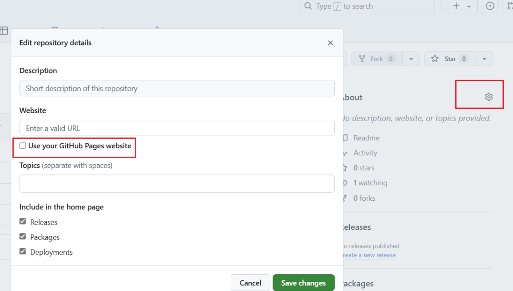

## 关于GitHub Pages

GitHub Pages 是一项静态站点托管服务，它直接从 GitHub 上的仓库获取 HTML、CSS 和 JavaScript 文件，（可选）通过构建过程运行文件，然后发布网站。


更多概念可参考相关文档：[about github pages](https://docs.github.com/zh/pages/getting-started-with-github-pages/about-github-pages)

一些重点：
- 用户站点：`<username>.github.io`
- 项目站点：`http(s)://<username>.github.io/<repository>`
- 只能为 GitHub 上的每个帐户创建一个用户或组织站点。 项目站点（无论是组织还是个人帐户拥有）没有限制。
- 如果要创建用户或组织站点，则存储库必须命名为 `<user>.github.io` 或 `<organization>.github.io`，且名称必须使用小写字母
## 部署博客项目
博客项目部署在用户站点的根目录下，仓库命名根据上面的规则使用`<user>.github.io`格式：

## 部署小项目
项目站点的仓库名会作为访问路径的一部分，同样需要在Pages中设置：

完成后就可以通过此网址访问项目了：
