## REF

- 按照[Waline官方文档](https://waline.js.org/guide/get-started/)可以快速上手配置
- 有不清楚的地方以及后面的邮件模板可以参照 [失迹の博客](https://blog.reincarnatey.net/2024/0719-better-waline/)

## 设置数据库（LeanCloud）
按照Waline文档的步骤走，[注册](https://console.leancloud.app/register)好LeanCloud国际版

博客选择开发者版本就够用了：
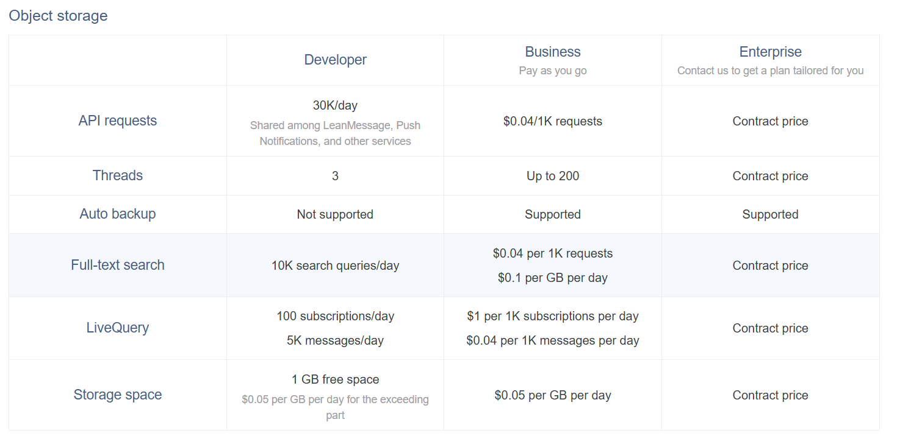

记住三个应用凭证：
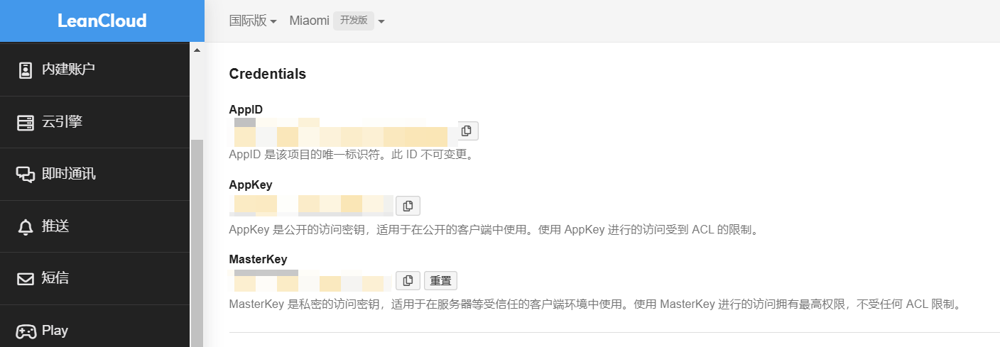
## 部署服务端（Vercel）
服务端可以通过 docker 进行部署或直接部署在自托管环境上，也可以部署到其他常见云平台，这里我选择用Vercel部署。

按照Waline文档的步骤走，如果没有在仓库安装过Vercel，则会跳出安装页面：
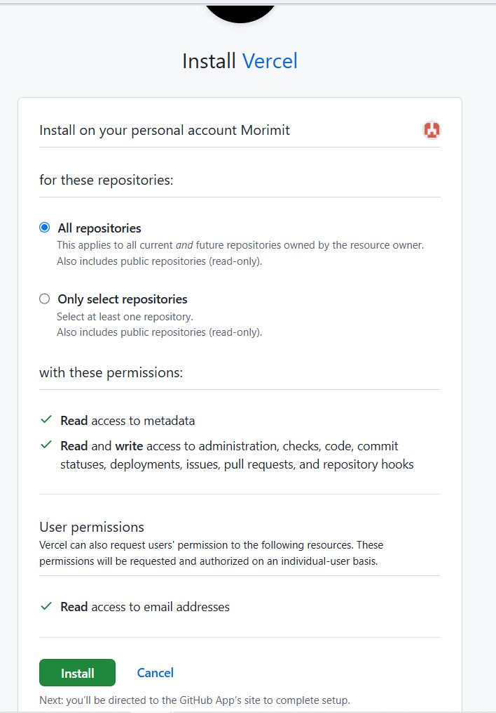
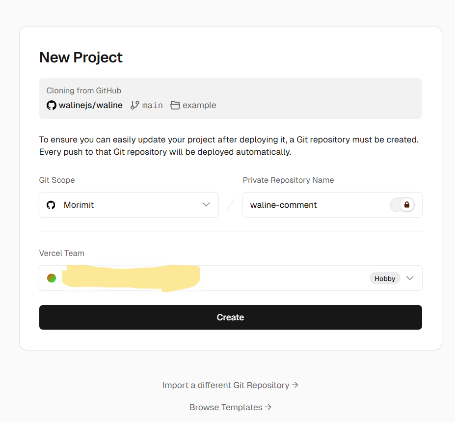
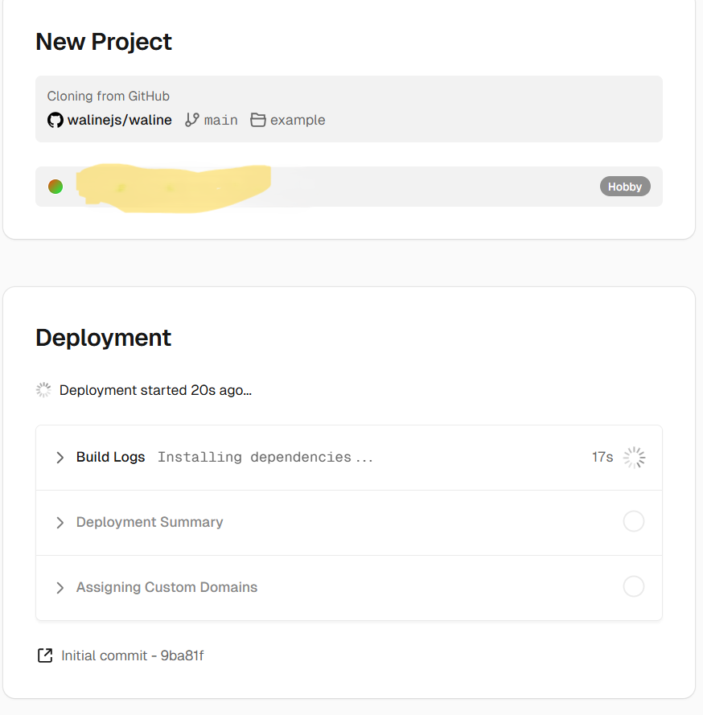
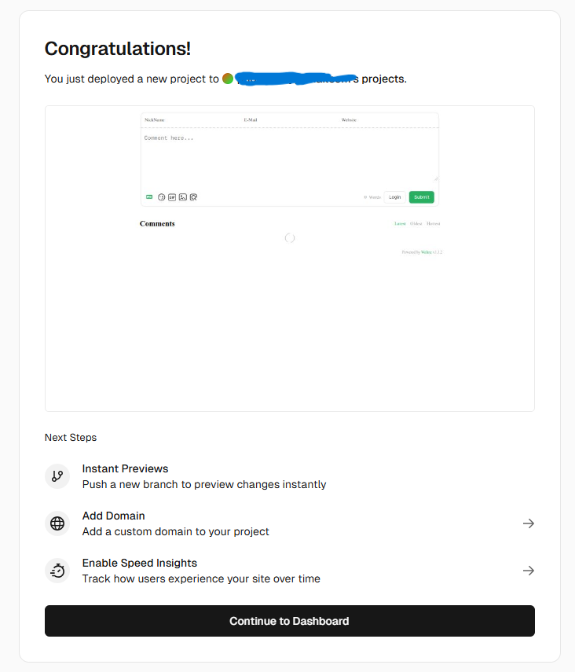

上图分别展示了安装Vercel、创建项目、Vercel基于Waline模板自动化部署的过程。


接下里是在这个项目里添加三个环境变量，分别对应上面的三个LeanCloud凭证：
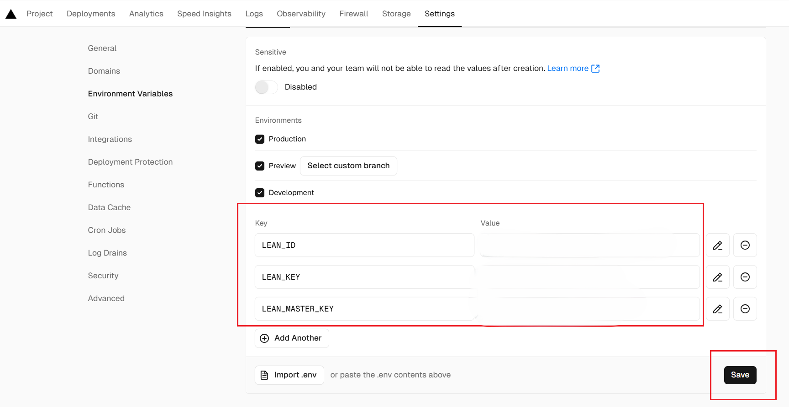

每次配置新的环境变量后都要重新部署：
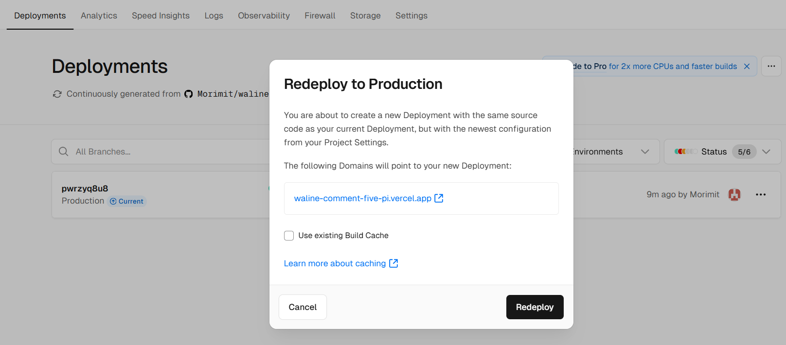

部署成功后可以通过服务端地址访问服务端了：
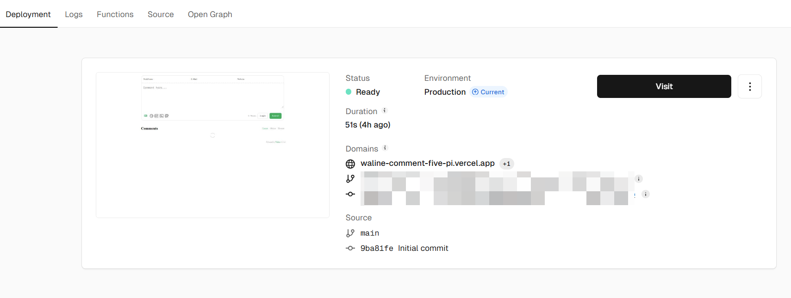

## 绑定域名（可选）
可以把vercel绑定自己的域名，这里我直接用vercel自动分配的域名了~

## 配置客户端（Hugo博客）
此博客基于的Stack主题是集成了Waline评论模板的，只不过样式用的是v2，而目前官网已经更新到v3了，所以可以参考Waline文档把引入样式表和js脚本都换成v3的：

在`config.yaml`文件中开启评论区并配置相关参数：
```yaml
comments:
        enabled: true
        provider: waline
```
在`layouts\partials\comments\provider\waline.html`文件中修改代码：
```go

<link
rel="stylesheet"
href="https://unpkg.com/@waline/client@v3/dist/waline.css"
/>

<div id="waline" class="waline-container"></div>

<style>
    .waline-container {
        background-color: var(--card-background);
        border-radius: var(--card-border-radius);
        box-shadow: var(--shadow-l1);
        padding: var(--card-padding);
        --waline-font-size: var(--article-font-size);
    }
    .waline-container .wl-count {
        color: var(--card-text-color-main);
    }
</style>

{{- with .Site.Params.comments.waline -}}
{{- $config := dict "el" "#waline" "dark" `html[data-scheme="dark"]` -}}
{{- $replaceKeys := dict "serverurl" "serverURL" "requiredmeta" "requiredMeta" "wordlimit" "wordLimit" "pagesize" "pageSize" "avatarcdn" "avatarCDN" "avatarforce" "avatarForce" -}}

    {{- range $key, $val := . -}}
        {{- if $val -}}  
            {{- $replaceKey := index $replaceKeys $key -}}
            {{- $k := default $key $replaceKey -}}

            {{- $config = merge $config (dict $k $val) -}}
        {{- end -}}
    {{- end -}}

  <script type="module">
    import { init } from 'https://unpkg.com/@waline/client@v3/dist/waline.js';

    init({{ $config | jsonify | safeJS }});
  </script>
{{- end -}}

```

看评论区右下角的Powered by Waline后面的版本号可以知道是否配置成功

完成上面的步骤后，就可以在评论区留言了：
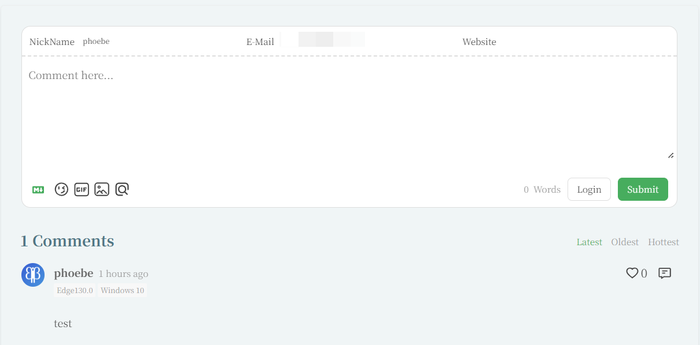

## 登录管理端（评论管理）


1. 部署完成后，请访问 `<serverURL>/ui/register` 进行注册。首个注册的人会被设定成管理员。
2. 管理员登陆后，即可看到评论管理界面。在这里可以修改、标记或删除评论。
3. 用户也可通过评论框注册账号，登陆后会跳转到自己的档案页。


其中`serverURL`即服务端的地址


注册后就可以管理评论了:
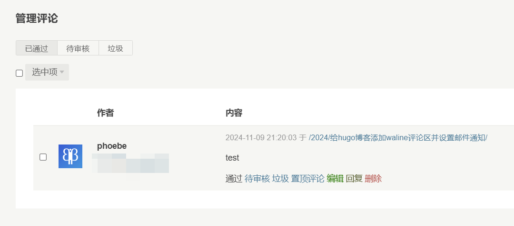


## 解决Vercel DNS污染问题（待尝试）
- 可以参考[这个博客](https://www.cnblogs.com/cubeyu/articles/17451621.html)


## 配置评论邮件通知
首先了解一下两个协议，SMTP是可以从邮件客户端向邮件服务端发送、中继或转发邮件的协议，IMAP是可以从邮件服务器上获取邮件信息、下载邮件的协议。

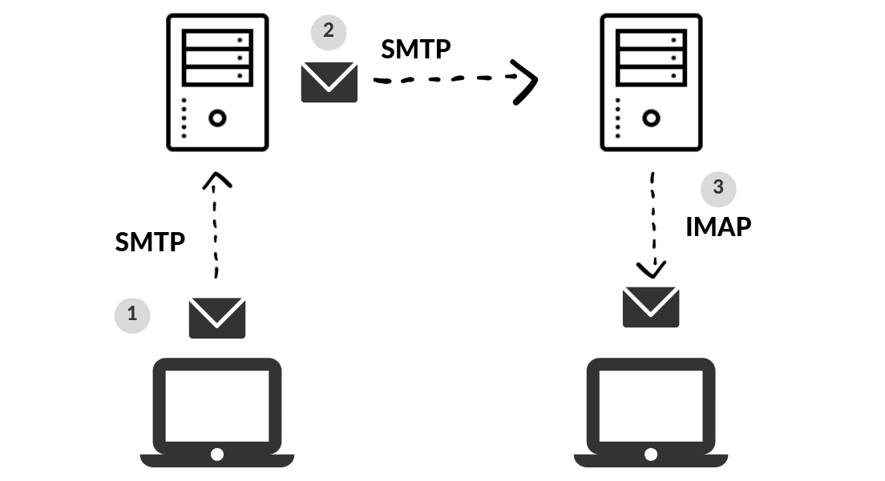

这里我们通过配置Vercel的SMTP环境变量，每当有评论的时候就让SMTP服务端来发送邮件。

SMTP服务端可以自己用服务器搭建，也可以选择各大邮件服务商。这里我一开始用Outlook邮件一直没成功，后面还是用Gmail了。

### Gmail启用IMAP
Gmail在打开IMAP的同时也会打开SMTP
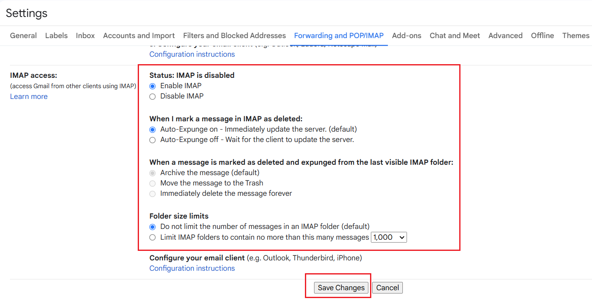

此外还要打开Google账号的两步验证，然后才能生成一个App password（后面要填入环境变量）。

### 开启163邮箱的IMAP/SMTP服务
Gmail被封了，还是用上了163邮箱。

首先找到设置，开启IMAP/SMTP服务
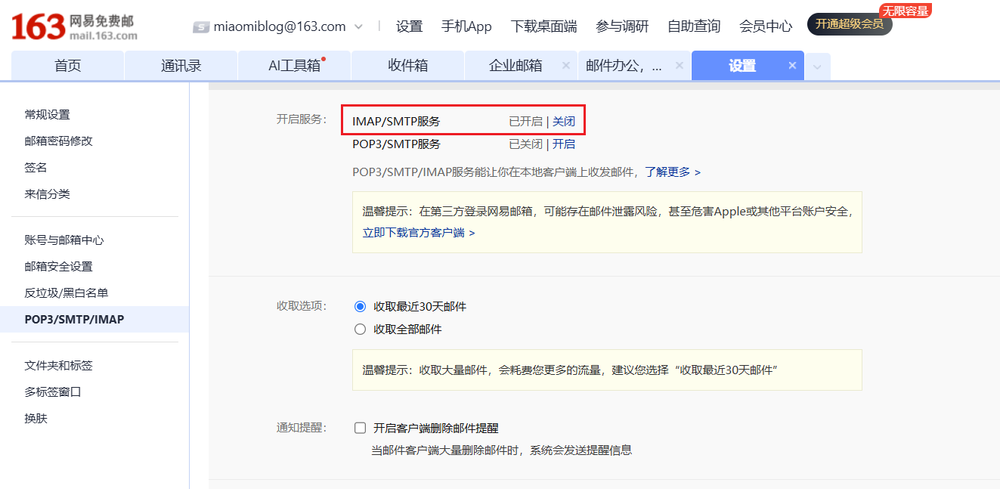
比较坑的地方是授权码只有180天有效期。

---


有个小坑：SMTP_USER的值必须和SENDER_EMAIL的值一致，否则会一直收不到邮件通知，再查看vercel的日志，会发现错误代码553

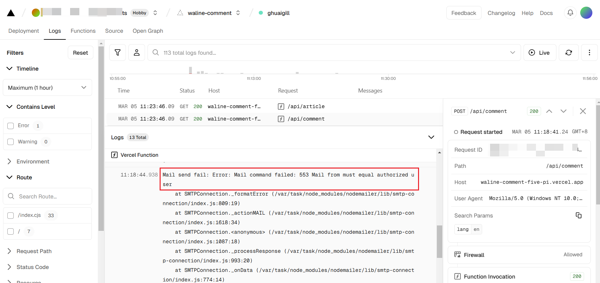

### 配置Vercel环境变量
需要配置以下环境变量：
- SMTP_SERVICE：Gmail/163（如果是waline支持的运营商，就不用填SMTP_HOST 和 SMTP_PORT）
- SMTP_USER：youremail@gmail.com
- SMTP_PASS：gmail填上面获取的App password，有16位，要删除空格/163mail填SMTP授权码
- SITE_NAME：填博客的名字
- SITE_URL：https://your-site-domain-name
- AUTHOR_EMAIL：填自己常用的邮箱(最好是上面评论管理的管理员邮箱)，用来接收评论通知

以下是选填的环境变量:

- SENDER_NAME: Miaomi's Blog
- SENDER_EMAIL: 自定义发送邮件的发件地址（如果使用gmail可以自定义，如果用163则必须保证此值和SMTP_USER一致）
- MAIL_SUBJECT: Dear {{parent.nick | safe}}，your comment on {{site.name | safe}}'s Blog received a reply
- MAIL_TEMPLATE: 自定义评论回复邮件内容(可直接贴HTML代码)
- MAIL_SUBJECT_ADMIN: 亲爱的站长，您的博客{{site.name | safe}}收到一条新评论，请及时回复哦~
- MAIL_TEMPLATE_ADMIN: 自定义新评论通知邮件内容(可直接贴HTML代码)

记得**每次配置好环境变量都要点redeploy才会生效**

一切准备就绪后，评论区有回复都能收到邮件通知了~

默认的邮件模板如下：
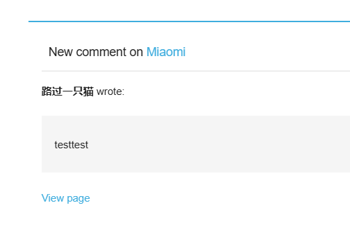
有时间一定要改一下模板，看着和我的主题色不太搭~

