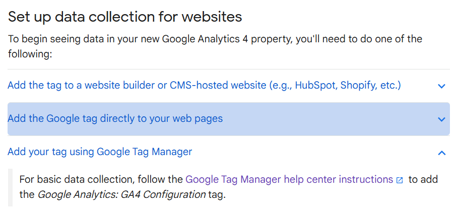
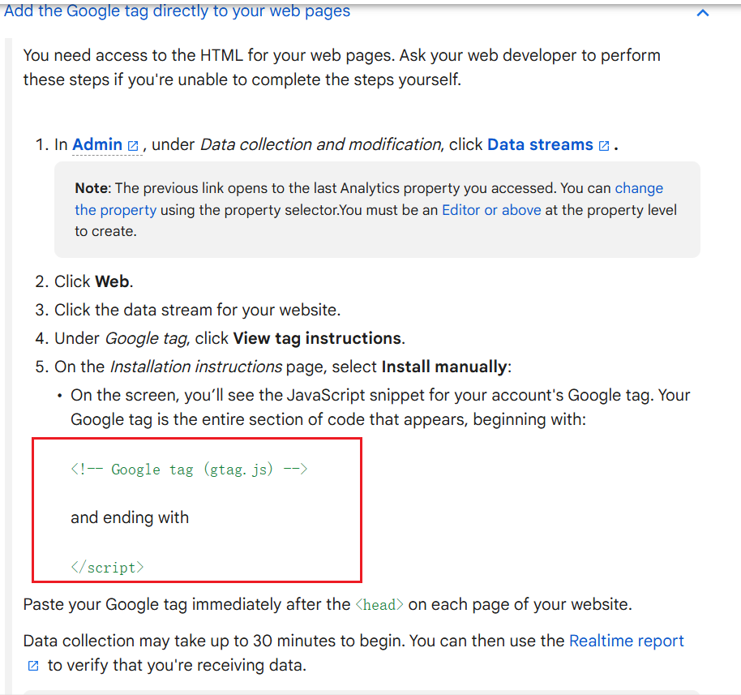
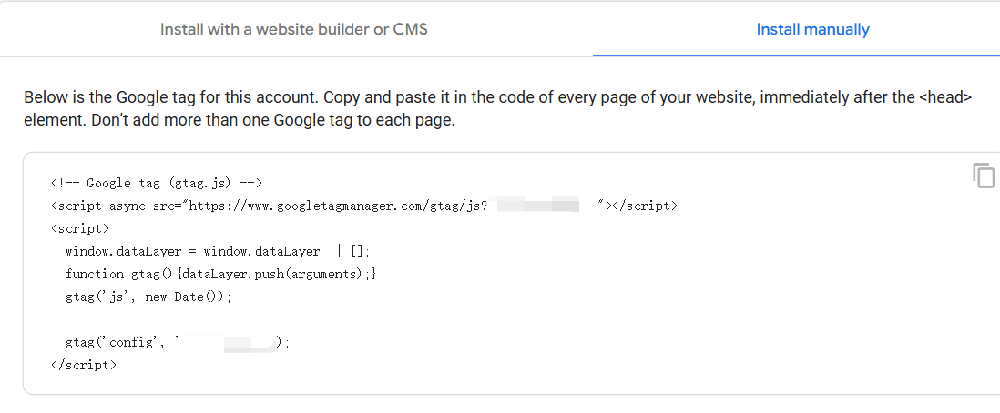
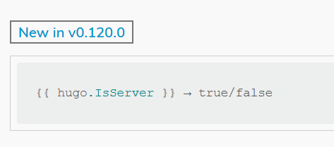

## 什么是Google Analytics
Google Analytics 4 (GA4) 是 Google 的一种网络分析工具，可让你免费跟踪和衡量网站上的用户流量和行为。

## 给网站添加GA的跟踪代码

注册什么的直接跟着[官方文档](https://support.google.com/analytics/answer/9304153?sjid=1742798696676955087-NC#zippy=)走，关键在于GA ID的设置上：


这里是给博客添加GA代码，而Hugo博客生成器对GA本身有代码支持，所以选第二个


继续跟着步骤走，找到这段代码


将这段含有GA ID的代码保存到博客layouts根目录下的 `_internal/google_analytics.html`文件夹中

然后在博客`layouts/partials/head/head.html`文件中使用该模板：
```go
{{/* 防止hugo server的流量也计入流量监测 */}}
{{- if not .Site.IsServer -}}
    {{- template "_internal/google_analytics_async.html" . -}}
{{- end -}}
{{- partial "head/custom.html" . -}}
```

注意hugo v0.120.0之后不再使用`.Site.IsServer`：


在博客config文件中也添加：
```yaml
# GA Tracking ID
services:
  googleAnalytics:
    id: G-yourID
```

最后虽然文档说是30分钟，但我却是过几个小时后才在Google Analytics上看到访客数据。
## References

- [比较老的教程，但来龙去脉写得比较完整](https://note.qidong.name/2017/07/05/google-analytics-in-hugo/)
- [与上面相反](https://immwind.com/google-analytics-for-hugo/)
- [主要步骤还是看最新的GA官方文档](https://support.google.com/analytics/answer/9304153?sjid=1742798696676955087-NC)