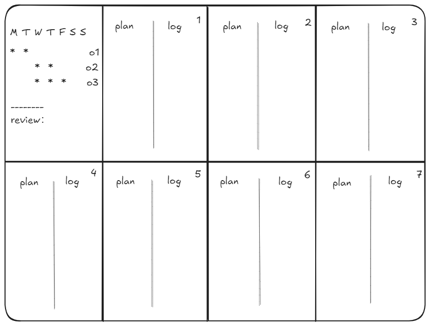

## 为什么要做计划

在开始做计划前，必须问自己一个问题——为什么要做？

**这个问题的答案越具体越好**。

在没有问出这个问题，心中也没有答案的时候，就很容易做出这样的计划——

看着满满当当能做很多事情，可真当执行的时候，一开始就会发现超时的问题。

如果超时了，却硬要按照计划走，没学会的东西硬标学会了，假账越累越多，学习债也越积越厚；如果不按计划走，改动的内容牵一发而动全身，就容易不知道计划该如何写了。

**注意，计划的把控在于三个方面**：
- 内心的动力（即为什么要做此计划）
- 方向感（来源于对计划的复盘和调整）
- 能够定期调整的计划

Version 0计划的方式看似参照了学校课程表，但别忘了，课程表不会管学生有没有真的掌握某个知识点，而是只管灌输知识的时间把控。

完全跟着学校的课表走，牵一步走一步，容易让自身缺乏动力、实际计划调整和方向感。

所以即使别人给定的计划再清晰，我们也还要再问自己一次：为什么要做计划？

即使我们已经制定好了计划，执行到中段有点迷茫的时候，也可以随时回到这个问题——
- 是为了学习某个技能/学科？
- 是为了推进某个项目？
- 是为了建立某个routine？
- ...

## 做计划的那些年

### 第一阶段
第一阶段我做的计划虽然没有用timeline限制得那么紧了，但目标感不清晰，没有具体回答“为什么做计划”的问题。

做出的计划大概是这样的：

乍一看时间都可以调整，没什么问题，但是内容不够细节（目标不够明确集中），导致容易产生每天都是同一天的疲倦感。

**********************

第一阶段还使用过habitica打卡，这个软件采用游戏的形式，如果错过打卡会掉血条，坚持打卡能够升级。

游戏机制是好的，日常打卡任务和具有deadline的任务区分也很人性化，但是打卡任务依然给我一种西西弗斯式的疲倦感。

### 第二阶段

第二阶段首先明确了记录的目的：记录真正在意的事情

其次明确了笔记的类型：
- 封存层：我的记录，如日记、书影音笔记、收集的素材、方法论等
- 构思层：我的想法，如各种头脑风暴和brain dump
- 行动层：我的行动，如每日、周、月、年计划的执行log或打卡表

最后明确两个视角
- 时间视角：每日-每周-每月-每年的plan & log
- 项目视角：总deadline-每个拆分项的deadline

这个阶段我用到了A4纸和OneNote，制作周、月、年计划：

左上角是目标打卡和周复盘

左下角是月度目标和月复盘

### 第三阶段

这个阶段，我保留了时间视角的月计划和年计划，使用obsidian的daily notes插件记录日计划:

最后还新增了项目视角的计划表：

本质上只要保持住daily notes的记录，坚持每天写一点，那么月计划和年计划就有素材可以复盘，项目表也会有记录可以追踪。

## 如何做计划

总结一下做计划的过程：
- 知道为什么要做计划、想要达成的目标，越具体越好
- 大方向用项目管理视角来管控
- 并将目标拆解到每日、周、月，进行记录和定期复盘

